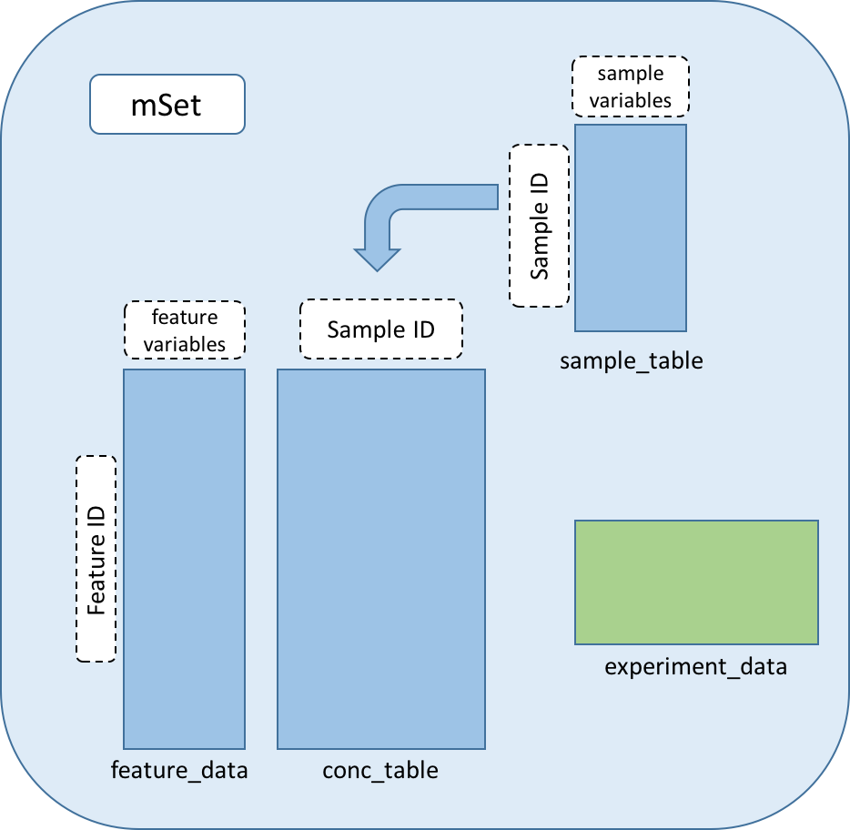

```{r setup, include = FALSE}
knitr::opts_chunk$set(
  collapse = TRUE,
  comment = "#>",
  message = FALSE, warning = FALSE, error = FALSE
)
```

# Background

With the development of mass spectrometry and analytical chemistry, these hight-through put experimental approches are being adopted into different fielts of researches. Those mass spectrometry or analytical chemistry based experiments generate huge data. The post-experminent data processing is always a big challenge to get the feature annotation from raw MS data. Metabolomics experiments generate hundreds to thousands small molecule compounds after annotation. This package provides a solution for data storage, handling, and visualization for metabolomics experiment datasets. This document describes the basic concept of this package.

# Object Oriented Design

The data of MS based experiments such as metabolomics can be divided in to three parts. A pure numeric matrix represents the concentration or abundance for each feature in each sample, a table with the MS information for each feature, such as m/z, ESI mode, annotation name, and chemical CID, and also a table with the experiment information for each sample such as the treatment group. In this package, the popular bioconductor's object oriented design is used. In bioconductor's core package, biobase, it designed some complex data structure in order to deal with the sequence data. In this package, the data structure is simplified. 

The mSet class contains 4 slots, a **conc_table** which derived from a numeric matrix, a **sample_table** derived from a data.frame, and a **feature_data** derived also from a data.frame. The experiment_data slot has a list-like structure and contains any additional information for the experiment.



