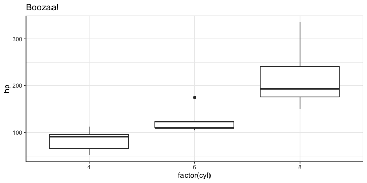

# zeallot, 用 R 实现 python 的 multiple assignment

## Multiple assignment in python

Python 有很多非常优秀的地方。让我非常喜欢的一个特点是它的 multiple assignment 的功能。假设我们要赋值给两个变量 `x` 和 `y`。常规的方法是：

```
x = 1
y = 2
```

如果 用 python 的 multiple assignment 的功能的话，就只用这样：

```
x, y = 1, 2
x
# 1
y
# 2
```

不仅如此，如果我们想要交换 `x` 和 `y` 的值的话，通常来说我们只能先把其中一个变量的值赋值给第三个中间变量。

```
z = x
x = y
y = z
```

而用 python 的话，只需要这样：

```
x, y = y, x
```

## Multiple assignment in R

那么，在 R 里有没有这样类似的 multiple assignemtn 的方法呢？答案已经在标题里了，就是用这个 `zeallot` package。`zeallot` package 利用一个特殊的操作符 `%<-%` 来完成 multiple assignment。

```
library(zeallot)
c(x, y) %<-% c(1, 2)
x
# [1] 1
y
# [2] 2
```

同样如果要交换 `x` 和 `y` 的值的话：

```
c(x, y) %<-% c(y, x)
x
# [1] 2
y
# [1] 1
```

`%<-%` 左边必须是用 `c` 包含的变量，而右边可以是 array 也可以是 list，只要左右两边的长度相等。

```
c(x, y) %<-% list(1, 2)
x
# [1] 1
y
# [1] 2
```

如果右边是一个 `data.frame` 的话，`data.frame`中的每一列则会被赋值给左边的变量

```
c(mpg, cyl, disp) %<-% mtcars[1:6, 1:3]
mpg
# [1] 21.0 21.0 22.8 21.4 18.7 18.1
cyl
# [1] 6 6 4 6 8 6
disp
# [1] 160 160 108 258 360 225
```

## Construct a data.frame

`zeallot` 还能用在构建 `data.frame` 多过程中。

```
df2 = data.frame(
    id = 1:6,
    c(mpg, cyl, disp) %<-% head(mtcars, 6)[,c("mpg", "cyl", "disp")]
)
df2
#                   id  mpg cyl disp
# Mazda RX4          1 21.0   6  160
# Mazda RX4 Wag      2 21.0   6  160
# Datsun 710         3 22.8   4  108
# Hornet 4 Drive     4 21.4   6  258
# Hornet Sportabout  5 18.7   8  360
# Valiant            6 18.1   6  225
```

## ggplot2 也能用

但得注意，右边必须得把 plots 放在 `list` 当中。用 `c` 显然是不行的..

```
library(ggplot2)
p1 = ggplot(mtcars, aes(factor(cyl), mpg)) + geom_boxplot()
p2 = ggplot(mtcars, aes(factor(cyl), hp)) + geom_boxplot()
c(p1, p2) %<-% lapply(list(p1, p2), function(p) p + theme_bw() + labs(title = "Boozaa!"))
p1
```


```
p2
```



## Unpacking in for loop

Python 的 multiple assignment 实际上是运用了 `tuple` 来实现的。而 `tuple` 还可以有更多的用途。比如在 for loop 中的 unpacking 尤其的方便：

```
alist = {'a':1, 'b':2, 'c':3}
for key, val in alist.items():
    print(key)
    print(val)
# x
# 1
# y
# 2
# z
# 3
```

可惜这个功能还没有在 R 或者 zeallot 中实现。