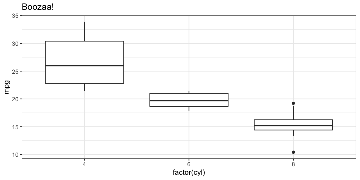
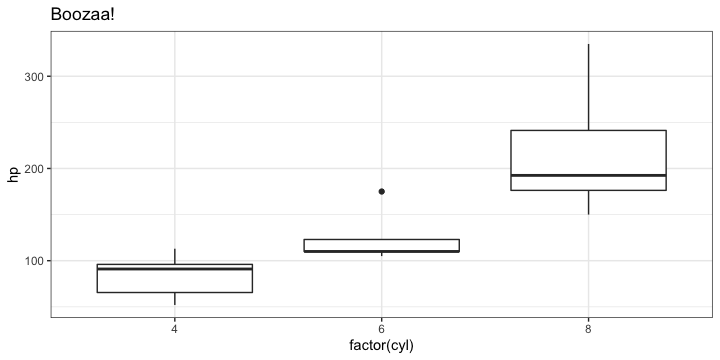

# Zeallot: Multiple assignment in R

## Multiple assignment in python

On of many things that I really enjoy when writing python is its multiple assignment functionality. Let's say that we want to assign two variables `x` and `y`, the typical way is :

```
x = 1
y = 2
```

And with python's multiple assignment, we can do this:

```
x, y = 1, 2
x
# 1
y
# 2
```

Even better. If we want to switch the value of x and y, the typical way is creating a third variable first.

```
z = x
x = y
y = z
```

And with the multiple assignment we can simply do:

```
x, y = y, x
```

## Multiple assignment in R

So, is there a way to do some thing similar in R? The answer is already in the title of this post. The zeallot package allows you to perform multiple assignment in R, by using the `%<-%` symbol.

```
library(zeallot)
c(x, y) %<-% c(1, 2)
x
# [1] 1
y
# [2] 2
```

And we can switch the values of `x` and `y` using this too.

```
c(x, y) %<-% c(y, x)
x
# [1] 2
y
# [1] 1
```

The left side of `%<-%` must be variables wrapped in a `c` function, while the right side can either be an array or list with the same length as the left side.

```
c(x, y) %<-% list(1, 2)
x
# [1] 1
y
# [1] 2
```

## Unpacking data.frame

If the right side is `data.frame`, the columns will be assigned to the left side.

```
c(mpg, cyl, disp) %<-% mtcars[1:6, 1:3]
mpg
# [1] 21.0 21.0 22.8 21.4 18.7 18.1
cyl
# [1] 6 6 4 6 8 6
disp
# [1] 160 160 108 258 360 225
```

## Construct a data.frame

`zeallot` can also be used during the construction of a data.frame.

```
df2 = data.frame(
    id = 1:6,
    c(mpg, cyl, disp) %<-% head(mtcars, 6)[,c("mpg", "cyl", "disp")]
)
df2
#                   id  mpg cyl disp
# Mazda RX4          1 21.0   6  160
# Mazda RX4 Wag      2 21.0   6  160
# Datsun 710         3 22.8   4  108
# Hornet 4 Drive     4 21.4   6  258
# Hornet Sportabout  5 18.7   8  360
# Valiant            6 18.1   6  225
```

## Works for ggplot, too

Yes, it is. But you just have to use `list` on the right side. Using `c` seems not gonna work.

```
library(ggplot2)
p1 = ggplot(mtcars, aes(factor(cyl), mpg)) + geom_boxplot()
p2 = ggplot(mtcars, aes(factor(cyl), hp)) + geom_boxplot()
c(p1, p2) %<-% lapply(list(p1, p2), function(p) p + theme_bw() + labs(title = "Boozaa!"))
p1
```



```
p2
```



## Unpacking in for loop

The multiple assignment in Python actually uses a special data structure called `tuple`, which also allows unpacking in a for loop.

```
alist = {'a':1, 'b':2, 'c':3}
for key, val in alist.items():
    print(key)
    print(val)
# x
# 1
# y
# 2
# z
# 3
```

But unfortunately this functionality is not implemented in R yet.